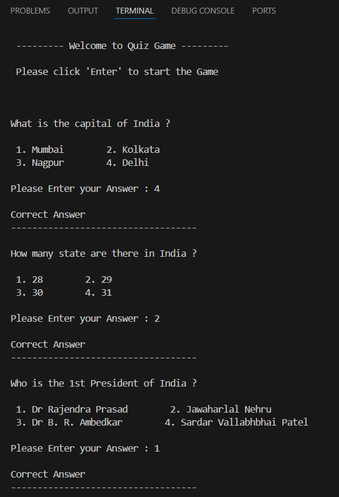

# 🎮 Quiz Game in Python


Welcome to the **Quiz Game**, a simple and interactive command-line quiz application built using Python. This project is great for beginners learning about conditionals, loops, user input, and list handling in Python.

---

## 🧠 Game Description


```text
      ---------- Welcome to Quiz Game ---------

      Please click on 'Enter' to start the Game
```

- When you run the program, it welcomes you with a stylized header.
- You'll be prompted to press **Enter** to start the game.
- The game then displays **10 multiple-choice questions**.
- For each correct answer, you earn **10 points**.
- At the end, your total score (out of 100) is shown.



---

## ✅ Features

- 🧩 10 General Knowledge Questions  
- 🎯 Instant feedback on your answer  
- 📊 Score calculated and displayed at the end
- 🎮 User-friendly terminal interaction  
- 🐍 100% Pure Python

---

## 🚀 How to Run

1. Make sure Python is installed on your system.
2. Save the Python code in a file, for example: `quiz_game.py`
3. Open a terminal or command prompt in the file’s directory.
4. Run the game:

```bash
python quiz_game.py
```

## 🧾 Sample Questions

- What is the capital of India ?
- How many states are there in India?
- Who was the the first President of India ?
- Python language was developed by ?

## 🧑‍💻 Code Overview

- Question are store in list, where each entry has
    - Question Text
    - Four options
    - Corrrect option number
- The program loops through each question, takes input, checks the answer, and update the score.

## 📁 File Structure

```bash
📁 Quiz-Game/
├──  📄 Quiz.py               # Main Python script
├──  📄 README.md             # Project Documentation ( This file)
└──  📁 assets/
      └── 📸 screenshot.png   # Screenshot of the game
```

## 💡Future Improvement

- 🧠 Add difficulty levels (Easy, Medium, Hard)
- 🔀 Shuffle questions on every game run
- 💾 Store high scores in a file or database
- 🖥️ Create a GUI version using 'Tkinter' or 'PyQt'
- 🌐 Web version using Flask or Streamlit

## 📜 License

This project is open-source and free to use  for learning purpose.

## 🙌 Contribute
If you’d like to add more features or new questions, feel free to fork this repo and make a pull request.